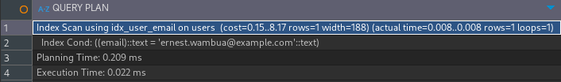
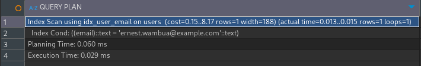

# Index Performance

## Query

```sql
-- Before Indexing
EXPLAIN ANALYZE
SELECT * FROM users
WHERE email = 'ernest.wambua@example.com';

-- Create Index
CREATE INDEX idx_users_email ON users(email);

-- After Indexing
EXPLAIN ANALYZE
SELECT * FROM users
WHERE email = 'ernest.wambua@example.com';
```

## Performance Analysis

**Without Index**



**With Index**

